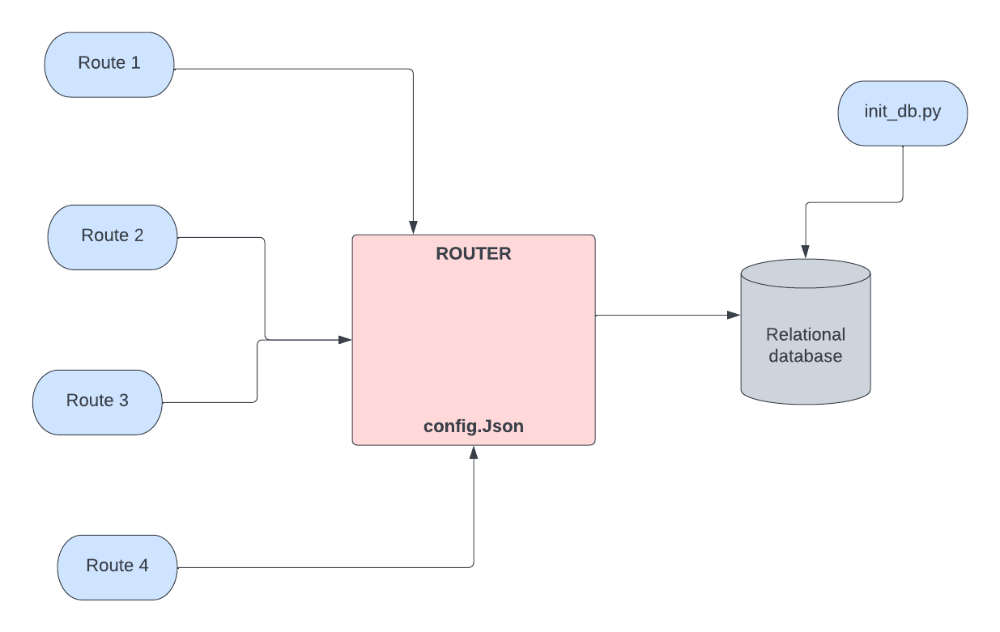
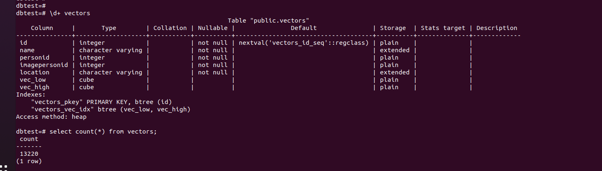
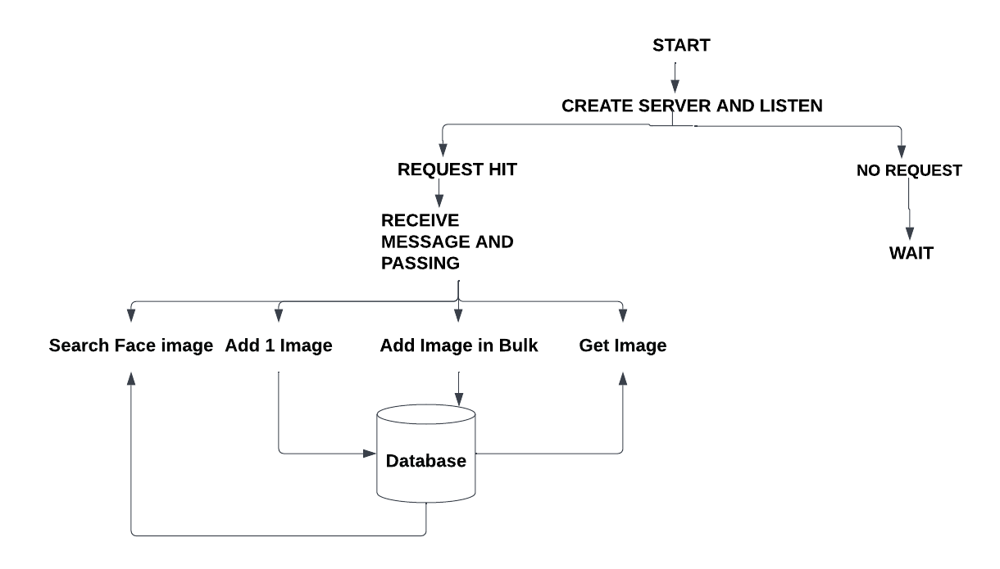
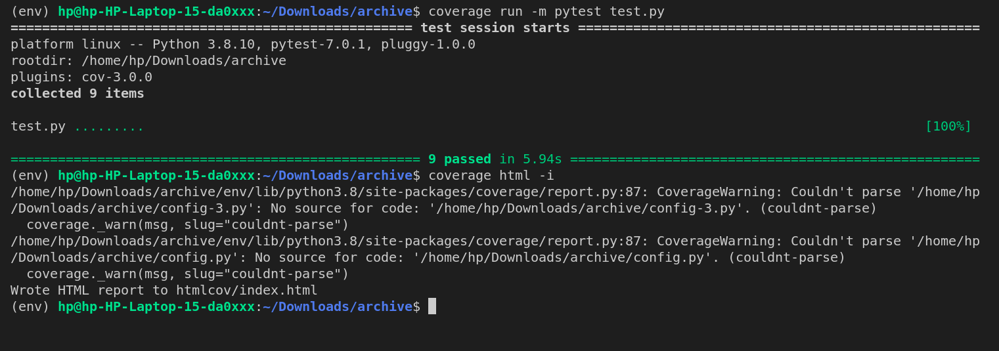

# CS-305 Assignment 2

=================================

Submitter name: Preetesh Verma

Roll Number: 2018eeb1171

Course: Software Engineering 

=================================


## Problem Statement

We need to develop an application that performs the “facial search” on a database of images. The application should be a secure API service which can be invoked by sending an HTTP post request to the API’s endpoint. 
Following are the main features:
1. The application should provide an API that can be used to populate the “face” image database. The face database should be designed such that it can store:
	
    a. An efficient representation of a given face image.
	
    b. Metadata about the face image such as name of the person, version number,date and location when the face image was captured.

2. An API for efficient and fast retrieval of top-k matches in the database, when an
unknown photo is supplied with a given threshold .

Thus, the problem statement asked us to create a image finder service where we first need to store the image in a Relational Database from the LFW Database and thereafter we need to develop certain API Endpoints for getting face image info,adding new data to database and to retreive top matching images to an input image. The database needs to be relational and should also contain meta-data regarding the image as well such as name,location etc. The details such as k and threshold would also be passed as arguments to the API calls. Thus, we are building an image searcher platform where user can provide any image and we try to return the closest possible answer as to who that image belongs to.


## Approach to Solution

### Overview

As part of the solution, first I downloaded the LFW dataset from Kaggel website and extracted its content. There are over 13,000 images present in the dataset of various people along with their metadata. For creating the service we had to store these images and there corresponding metadata into a relational database. For connecting to the database I used the config.json file which contains the Host, Database-name, User, Password. 
The database schema used by me as follows:
```
create table vectors (id serial PRIMARY KEY,"
                    "Name VARCHAR NOT NULL,"
                    "PersonID INTEGER NOT NULL,"
                    'ImagePersonID INTEGER NOT NULL,'
                    'Location VARCHAR NOT NULL,'
                    " vec_low cube, vec_high cube)
```
Here id is the serial auto-increment provided by PSQL, name is the name of the person of whose image it is, personID is the unique Id of that person and ImagePersonID is the image version number belonging to that person,location is the location of the image in the system and then to store the image I have converted the image into embeddings using the "face_recognition" library and stores them as cube array.CUBE is an extension provided by PSQL.
Then i started working on creating various helper functions which would help me carry out the necessary SQL queries on the database to develop the API routes. After developing these util functions I created the main class application which would perform the four tasks given in the assignment. In the end I implemented the test cases to properly verify the working of my API.For face-find algorithm I used the CUBE Extension of the PSQL and the encodings from the face_recognition module and then calculated the similarity over the entire database in PSQL itself to make it performant and efficient.
Here is the overall working procedure for the API


### Directory Structure
Here is the main directory structure:

```

├── app.py
├── config.json
├── db_helper.py
├── face_find_images
│   ├── Bush_George_W.jpg
│   ├── George_Lucas.jpg
│   ├── Roger_Federer.jpg
│   ├── sachin.jpg
│   ├── Tiger_Woods.jpg
│   └── Yuri_Fedotov.jpg
├── file.py
├── htmlcov
│   ├── app_py.html
│   ├── coverage_html.js
│   ├── d_c810615cce0f7acb_bulk_upload_py.html
│   ├── d_c810615cce0f7acb_face_find_py.html
│   ├── d_c810615cce0f7acb_face_info_py.html
│   ├── d_c810615cce0f7acb_face_upload_py.html
│   ├── d_c810615cce0f7acb_json_helper_py.html
│   ├── favicon_32.png
│   ├── index.html
│   ├── keybd_closed.png
│   ├── keybd_open.png
│   ├── status.json
│   ├── style.css
│   └── test_py.html
├── images
│   ├── SachinTendulkar_101010_1.jpg
│   └── ViratKohli_181818_1.jpg
├── images.zip
├── init_db.py
├── pictures
│   ├── command.png
│   ├── coverage.png
│   ├── flow_chart.png
│   └── procedure.png
├── README.md
├── requirements.txt
├── test.py
└── utils
    ├── bulk_upload.py
    ├── face_find.py
    ├── face_info.py
    ├── face_upload.py
    ├── json_helper.py

```

### Detailed Explanation of the solution and contents of each file

### init_db.py
This file contains the code written by me to create the database with the schema mentioned above.To extract the encodings from the LFW dataset and insert them into the database. I have used face_recognition library to get the encodings and also used CUBE Array extension in PSQL.


### file.py
This file is responsible for creating the flask server for message routing.
This file serves as the higher-level abstraction for the app.py which contains all the inner working of the flask server.

### app.py
This file contains the bulk of the code responsible for running the server. First, after receiving an instance of the app object it connects to the Relational Database and listens to the request on receiving which it would perform the asked function and return an appropiate response based on the successful working of the API.

The code flow is somewhat like this in the flow chart:


### util/***.py

The files here are mainly responsible for implementing the SQL query helper function to ease the coding complexity in the main flask server file.

### test.py

This is the file containing the unit tests written by me to test the code.
I have used the Pytest library to test the work. First of all, I am creating a flask app in the file and then calling different functions using the same.
The test.py file is enough to run and carry out any possible request.
The code coverage is over 96% and over 15 tests have been written to test the different API points.
I have done both good and  bad request for each api endpoint and tested it and used several images for testing the face-find api call.

## Procedure to run the files
The technology stack used by me is Python + pytest + Coverage.py + Flask .
The procedure to work on the assignment is as follows:
1) Download the zip file.
2) Extract the contents of the zip file and then create a virtual python environment (not necessary )
using the commands
```
python3 -m venv environment_name
source environment_name/bin/activate
```

and install all the necessary dependents using the requirements.txt.The command for the same is 

```
pip install -r requirements.txt
```
(Note for certain Linux systems it is pip3).
Most of the dependencies should be successfully installed using this and if bs4 is not then also no worry.

3) One needs to then go to the config file and make the database changes if needed. Do not change the location of the config file.

4) After installing the dependencies and making the required changes one needs to run the test file which can be done by using the command:
```
coverage run -m pytest test.py
```
This would successfully run the test file.
To see the code coverage use:
```
coverage html -i
```
Then one can simply view the coverage details by going into the htmlcov folder created and openeing the index.html file in any browser.

If one wants to test a new image for any functionality, it can be done by just providing the correct image location in the desired route testing function.

def test_route_1()--- @app.route('/get_face_info') take any random number for this

def test_route_2()--- @app.route('/search_faces') images from face_find_images directory

def test_route_3()--- @app.route('/add_face') I have used AbrahamLincoln_10000_1.jpg image for this test

def test_route_4()--- @app.route('/add_face_in_bulk') I have used images.zip for this test

### Certain Design Approaches and Solid Principles
These were certain approaches used by me in the completion of this code.

1) The Single-responsibility principle (SRP)
“A class should have one, and only one, reason to change”
In other words, every component of our code (in general a class, but also a function) should have one and only one responsibility. As a consequence of that, there should be only a reason to change it.
This helps in localizing the errors and reusing the code.

2) The Open–closed principle (OCP)
“Software entities … should be open for extension but closed for modification”
In other words: We should not need to modify the code you have already written to accommodate new functionality, but simply add what we now need.

3) Interface Segregation Principle
"Many client-specific interfaces are better than one general-purpose interface."
When we use functions from a module,we are using the disposed interface of that module, even if we are in a dynamically typed language, that interface still exists.We should provide one clear way of doing things instead of many, and we should expose only what is necessary for the users to perform the specific task.

4) Decorator Pattern
The decorator pattern is a design pattern that allows behaviour to be added to an individual object, dynamically, without affecting the behaviour of other objects from the same class. The decorator pattern is often useful for adhering to the Single Responsibility Principle, as it allows functionality to be divided between classes with unique areas of concern.


### Snapshots of the results

Tests running


Code Coverage


## Results

|Module|	statements|	missing|	excluded|	coverage|
|----|----|----|----|----|
app.py|	77|	4|	0|	95%|
test.py|	114|	0|	0|	100%|
utils/bulk_upload.py|	21|	2|	0|	90%|
utils/face_find.py|	15|	3|	0|	80%|
utils/face_info.py|	7|	0|	0|	100%|
utils/face_upload.py|	12|	2|	0|	83%|
utils/json_helper.py|	10|	0|	0|	100%|
Total|	256|	11|	0|	96%|


## References
https://flask.palletsprojects.com/en/2.0.x/tutorial/tests/

https://flask.palletsprojects.com/en/2.0.x/tutorial/tests/

https://www.digitalocean.com/community/tutorials/how-to-use-a-postgresql-database-in-a-flask-application

https://github.com/aaronjolson/flask-pytest-example