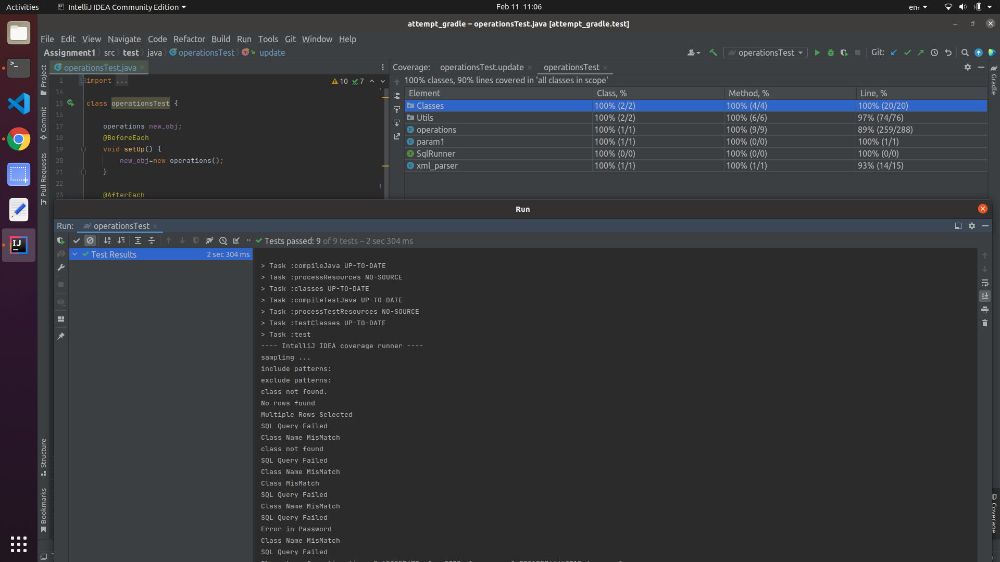

# CS-305 Assignment 1

=================================

Submitter name: Preetesh Verma

Roll No.:2018eeb1171

Course:Software Engineering

Link for repository::
https://github.com/Preetesh21/cs305-2022/tree/Assignment1

=================================


## Problem Statement

As part of this assignment, we were asked to implement a Java-based library for executing SQL queries for create, read, update, delete (CRUD) operations against an RDBMS. The library should provide an API that will allow the following:

1. Read the SQL queries from an XML based configuration file.
2. The parameters for the SQL queries will be dynamically populated at runtime from the supplied objects.
3. Populating plain-old-java-objects (POJOs) from the results of SELECT queries.

Thus, the assignment asked us to build an API that would have a connection with an MYSQL DataBase and we need to take user inputs as Objects, Primitive Data Types or Collections of Primitive Types and perform SQL Query. The SQL query has to be passed by an XML file and return results as objects or int depending on the query.


## Approach to Solution

### Overview
As part of the solution, I first implemented XML Parses which would be used to read the contents of the XML file provided to get the SQL Queries and paramType parameter based on the QueryID passed to it.

The results from this function would be given to the interface functions which will use them to run the SQL Query. Then I implemented a JDBC Connection between my MYSQL Server and my code. The MYSQL Server used by me is my personal device with a few instances (Actor Table,1 Trigger Function) being loaded into it for the purpose of testing the functionality of the code written. This connection was built using JDBC connection drivers.

Then I implemented the interface as asked in the question and performed its function using the class operations. The class had a few helper functions as well. The SQL queries were not fully complete and had few arguments which were to be given by the user. To fill these arguments with the values passed by the user I had implemented a Regex Matching function since the argument's position was helped by a fixed placeholder. The arguments were given as an Object QueryParam whose type had to be the same as the ParamType of the XML file.

After getting the arguments passed by the user from the Object and placing them in the correct position the SQL Query was run and appropriate outputs were generated which were either Object of Class ResultType passed by the user or an Integer depicting the number of rows affected by the query. To test these functions JUnit5 library was used and over 25 cases were written.


### Directory Structure of the src folder

```
├── Assignment1
│ ├── build
│ │ ├── classes
│ │ │ └── java
│ │ │     ├── main
│ │ │     │ ├── Classes
│ │ │     │ │ └── actor.class
│ │ │     │ ├── operations.class
│ │ │     │ ├── param1.class
│ │ │     │ ├── SqlRunner.class
│ │ │     │ ├── Utils
│ │ │     │ │ └── helper.class
│ │ │     │ └── xml_parser.class
│ │ │     └── test
│ │ │         └── operationsTest.class
│ │ ├── generated
│ │ │ └── sources
│ │ │     ├── annotationProcessor
│ │ │     │ └── java
│ │ │     │     ├── main
│ │ │     │     └── test
│ │ │     └── headers
│ │ │         └── java
│ │ │             ├── main
│ │ │             └── test
│ │ ├── reports
│ │ │ └── tests
│ │ │     └── test
│ │ │         ├── classes
│ │ │         │ └── operationsTest.html
│ │ │         ├── css
│ │ │         │ ├── base-style.css
│ │ │         │ └── style.css
│ │ │         ├── index.html
│ │ │         ├── js
│ │ │         │ └── report.js
│ │ │         └── packages
│ │ │             └── default-package.html
│ │ ├── test-results
│ │ │ └── test
│ │ │     ├── binary
│ │ │     │ ├── output.bin
│ │ │     │ ├── output.bin.idx
│ │ │     │ └── results.bin
│ │ │     └── TEST-operationsTest.xml
│ │ └── tmp
│ │     ├── compileJava
│ │     │ └── previous-compilation-data.bin
│ │     ├── compileTestJava
│ │     │ └── previous-compilation-data.bin
│ │     └── test
│ ├── build.gradle
│ ├── gradle
│ │ └── wrapper
│ │     ├── gradle-wrapper.jar
│ │     └── gradle-wrapper.properties
│ ├── gradlew
│ ├── gradlew.bat
│ ├── settings.gradle
│ └── src
│     ├── main
│     │ ├── java
│     │ │ ├── Classes
│     │ │ │ └── actor.java
│     │ │ ├── operations.java
│     │ │ ├── param1.java
│     │ │ ├── SqlRunner.java
│     │ │ ├── Utils
│     │ │ │ └── helper.java
│     │ │ └── xml_parser.java
│     │ └── resources
│     ├── queries.xml
│     └── test
│         ├── java
│         │ └── operationsTest.java
│         └── resources
├── images
│ ├── CodeCoverage.png
│ └── directory_structure.png
└── README.md

```

### Detailed Explanation of the solution and contents of each file

### operations.java

This file contains the main logic of the library. It is the implementation of the SQLRunner interface.
```
public interface SqlRunner {
   
    Object selectOne(String queryId, Object queryParam, Class resultType);
    List<?> selectMany(String queryId, Object queryParam, Class resultItemType);
    int update(String queryId, Object queryParam);
    int insert(String queryId, Object queryParam);
    int delete(String queryId, Object queryParam);
}

```
These functions have been implemented to carry out their respective SQL task and are supported by several helper functions. These helper functions assist them in the String passing of the query by placing appropriate values in the correct placeholders. There are several edge cases such as SQL query being invalid, QueryParam Object not containing value or is null or it's class not same as specified by paramType. The functions returned either the result object or the number of rows affected by the query. I have used PreparedStatement to perform the operation.

### xml_parser.java

This file contains single function which parses the XML file of queries. The function performs the task of extracting the Query and ParamType based on the QueryID provided to it.

### Utils/helper.java

This function for providing the parameters passed via QueryParam Object as per the parameter values that need to be filled in the SQL query. The function implements checks for parameters like:
1. Whether they are primitive Data Types
2. Whether they are a list of any type
3. Int Array
4. String Array
5. Custom Object with fields same as placeholders in SQL

For any other types (such as Float or DateTime) values can be passed as a list as well and will be handled.


### operationsTest.java

This is the file containing the unit tests written by me to test the functions. Simply I create an object of the CLass operations in the Setup function which is also set to null in the TearDown function and the same object is used to run the tests on each function and class used by me. The code coverage of the tests is 90% in terms of lines and 100% in terms of functions and classes.

## Procedure to run the files

Clone the repo into the system. Then using any suitable IDE such as IntelliJ, Apache NetBeans etc. open the project cs305-2022/Assignment1 in it. Build the project. Then in the src/main/java/operations.java and there in the Connection function change the configurations as per the requirements. Then we can easily run the operationsTest.java using the IDE itself. 
For running and testing we need to just run the operationsTest.java file. I used the Run operation button present on the IntelliJ. We need to just open the project in a IDE that supports Gradle and then use the Run option provided by it to run the operationsTest.java.

For creating tests one has to do the following:
1. Select and Create the query you want to run.
2. Then you need to add that SQL Query into XML file with unique sql_ID and paramtype.
3. After that you can :

    a. Create a custom object with feilds same as placeholders in SQL

    b. Pass the value(if single) directly irrespective of the dataType

    c. Pass the values(either single/multiple) as a List

    d. Pass Integer/ String Array(only these two arrays are done; for others use List);

The paramtype value needs to be adjusted as well according to the type of Object QueryParam.

(e.g. 5 is java.lang.Integer, false is java.lang.Boolean, "string" is java.lang.String, 5.32 is java.lang.Float,int[]: [I,   String []: [Ljava.lang.String;  List<>: java.util.ArrayList  etc).

E.g. Suppose we want to create a query to select one actor with actor_id=17.
```
Query:: SELECT * from actor where actor_id = ${propX};
```

Create an entry in the XML file with sql node.Supply it with a valid unique id and paramType of the kind of QueryParam that would be supplied to it.
In our case it could be an integer or an object with attribute propX.
So lets try with first option.
```
<sql id="latestQuery" paramType="java.lang.Integer">
        <![CDATA[
      select * from actor where actor_id = ${propX};
      ]]>
</sql>
```
Now in the operationsTest.java go under the selectOne function tester and create an integer variable(or directly pass integer value in the function call). Call the respective function as

```
Object resultObj = new_obj.selectOne("latestQuery",variable/value,actor.class);
```

Like this we could create several more queries and test.

For list the way would be
```
List<Integer> tt2;
tt2=new ArrayList<>();
tt2.add(7);
```

for custom object
```
class_name new_param=new class_name();
new_param.propX= ....;
new_param.propY= ....;
```

### Snapshots of the results

Code Coverage and Test Cases Running Successfully.


Directory Structure of the entire project


## Link for repository
https://github.com/Preetesh21/cs305-2022/tree/Assignment1

## References
https://stackoverflow.com/
https://docs.oracle.com/javase/tutorial/jdbc/basics/prepared.html
https://junit.org/junit5/docs/current/user-guide/
https://www.tutorialspoint.com/java_xml/java_dom_parse_document.htm
