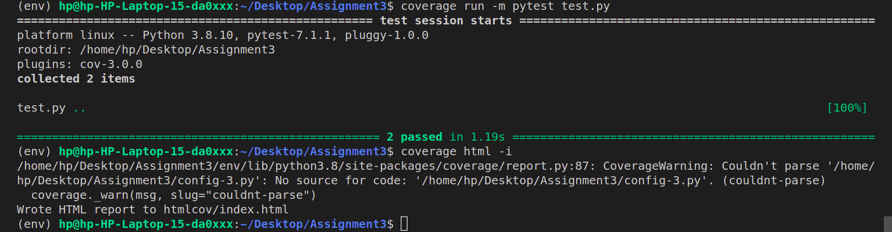
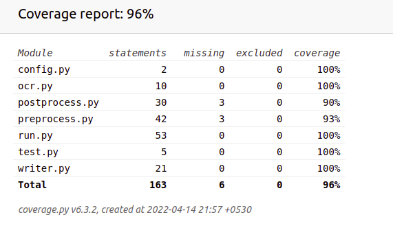

# CS-305 Assignment 3

=================================

Submitter name: Preetesh Verma

Roll Number: 2018eeb1171

Course: Software Engineering 

=================================


## Problem Statement

We need to design and develop an application which extracts the metadata from a collection of book cover pages. The cover pages of an book are scanned images (taken as a single image file) of the first few pages of the book. An example is shown at the end of this document. The cover page normally contains the following information (in addition to other stuff):
1. Title of the book
2. Names of the authors
3. Publishers
4. ISBN numbers

Thus, the problem statement asked us to create an image scanner which extracts the required text from the image and stores it into a sheet.


## Approach to Solution

### Directory Structure
Here is the main directory structure:

```

├── htmlcov
│   ├── config_py.html
│   ├── coverage_html.js
│   ├── favicon_32.png
│   ├── index.html
│   ├── keybd_closed.png
│   ├── keybd_open.png
│   ├── ocr_py.html
│   ├── postprocess_py.html
│   ├── preprocess_py.html
│   ├── run_py.html
│   ├── status.json
│   ├── style.css
│   ├── test_py.html
│   └── writer_py.html
├── img
│   ├── book_cover.jpg
│   └── isbn.png
├── isbn.png
├── book_cover.jpg
├── ocr.py
├── config.py
├── requirements.txt
├── output.xlsx
├── postprocess.py
├── preprocess.py
├── ReadMe.md
├── run.py
├── test.py
└── writer.py

```

### Detailed Explanation of the solution and contents of each file

## preprocess.py 
This file contains the code where all the pre processing of the image is taking place and we are doing operations such as thresholding, warp affine, finding contours, fixing the rotation if any in the image etc.

## postprocess.py
This file contains the code where all the post-processing of the resultant text is performed such as extra line removal etc.

## ocr.py
This file contains the code for tesseract.

## writer.py
This file contains the code which is responsible for creating the writing into the xlxs file.


### test.py

This is the file containing the unit tests written by me to test the code.
I have used the Pytest library to test the work. 
The test.py file is enough to run and carry out any possible request.
The code coverage is over 96%.

## Procedure to run the files
The technology stack used by me is Python + pytest + Coverage.py .
The procedure to work on the assignment is as follows:
1) Download the zip file.
2) Extract the contents of the zip file and then create a virtual python environment (not necessary )
using the commands
```
python3 -m venv environment_name
source environment_name/bin/activate
```

and install all the necessary dependents using the requirements.txt.The command for the same is 

```
pip install -r requirements.txt
```
(Note for certain Linux systems it is pip3).
Most of the dependencies should be successfully installed using this and if bs4 is not then also no worry.

3) One needs to then go to the config file and make the database changes if needed. Do not change the location of the config file.

4) After installing the dependencies and making the required changes one needs to run the test file which can be done by using the command:

```
coverage run -m pytest test.py --disable-warnings
```
This would successfully run the test file.
To see the code coverage use:
```
coverage html -i
```
Then one can simply view the coverage details by going into the htmlcov folder created and openeing the index.html file in any browser.

If one wants to test a new image for any functionality, it can be done by just providing the correct image location in the desired route testing function.

def test_single():--- testing for directory functionality

def test_directory():--- testing for directory functionality

To use the command line functionality go to the run.py file and uncomment the commented lines and use the command:

```
python3 run.py --flag true --input ./book_cover.jpg

```
### Certain Design Approaches and Solid Principles
These were certain approaches used by me in the completion of this code.

1) The Single-responsibility principle (SRP)
“A class should have one, and only one, reason to change”
In other words, every component of our code (in general a class, but also a function) should have one and only one responsibility. As a consequence of that, there should be only a reason to change it.
This helps in localizing the errors and reusing the code.

2) The Open–closed principle (OCP)
“Software entities … should be open for extension but closed for modification”
In other words: We should not need to modify the code you have already written to accommodate new functionality, but simply add what we now need.

3) Interface Segregation Principle
"Many client-specific interfaces are better than one general-purpose interface."
When we use functions from a module,we are using the disposed interface of that module, even if we are in a dynamically typed language, that interface still exists.We should provide one clear way of doing things instead of many, and we should expose only what is necessary for the users to perform the specific task.

4) Decorator Pattern
The decorator pattern is a design pattern that allows behaviour to be added to an individual object, dynamically, without affecting the behaviour of other objects from the same class. The decorator pattern is often useful for adhering to the Single Responsibility Principle, as it allows functionality to be divided between classes with unique areas of concern.


### Snapshots of the results

Tests running


Code Coverage
